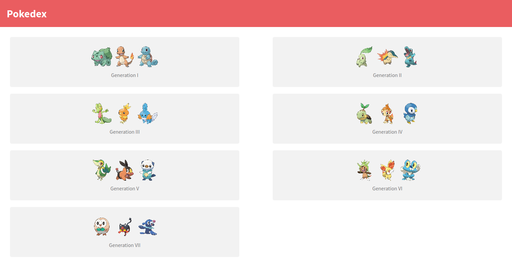
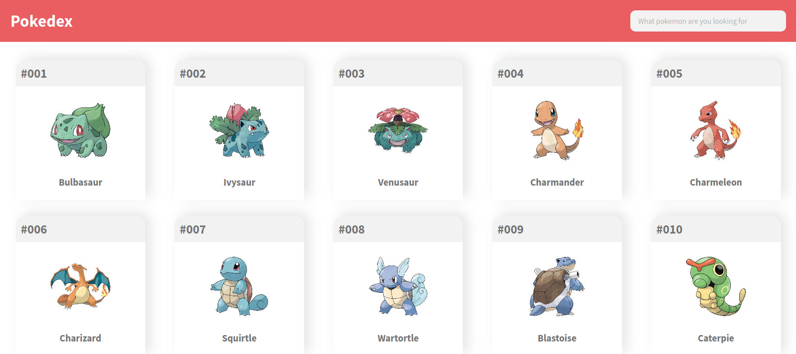
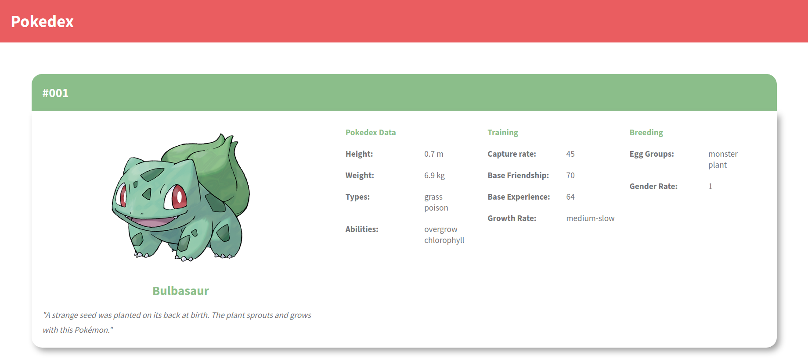

# POKEDEX

## Description

This web app uses the[PokeAPI](https://pokeapi.co/) to get all the pokemon by generation, also let you filter by pokemon on the search bar, and see the detailed information of the selected one.

## Built With

* Node.js
* React
* React-DOM
* React-Create-App
* Redux
* npm
* CSS
* ES6
* React Testing Library

Tools used on this project

- VSCode

## Demo

[Hosted on Heroku](https://bren2102-pokedex.herokuapp.com/)

## Instructions to run the project

+ Open terminal on your workspace with
```
cd /home/projects_workspace/..
```
+ Cloning the project input the next code:
```
git clone git@github.com:bren2102/PokeSearch.git
```
+ Navigate to the folder of the project
```
cd /PokeSearch/
```
Run `npm install` and `npm start` in your terminal/console.

## Screenshot





## Author
👤 **Brenda Yucra**

- Github: [@bren2102](https://github.com/bren2102)
- Twitter: [@BrendaYucra2](https://twitter.com/BrendaYucra)
- Linkedin: [Brenda Yucra](https://www.linkedin.com/in/brenda-yucra-51980681/)

## Contributing

This is an education project as a part of the Microverse so contributing is not accepted.

Contributions, issues, and feature requests are welcome!

Feel free to check the [issues](https://github.com/bren2102/PokeSearch/issues).

## Show your support

Give a ⭐️ if you like this project!

## Credits

+ UI based on this [Design](https://www.behance.net/gallery/95727849/Pokdex-App).
+ [PokeAPI](https://pokeapi.co/) was used to develop this app.
+ All the images are from this [Github repo](https://pokeapi.co/).

## License

This project is [MIT](lic.url) licensed.
